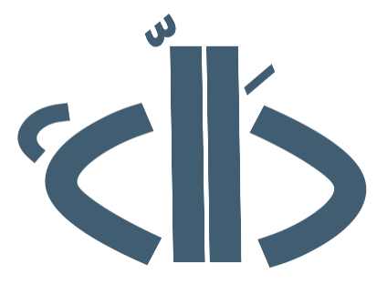

    

  

**دَالّة** هي منصة تعليمية تهدف لإثراء المحتوى العربي في مجال المعلوماتية والحوسبة الحيوية عبر نشر دروس وإقامة ورش عمل.

في هذه الصفحة، ننشر ملفات الأكواد المستعملة في الدروس العملية.

تابعونا على المنصات التالية:

الموقع الالكتروني | https://www.dalah.info/

منصة اكس  | https://x.com/Dalah_Info

لينكد إن |  https://www.linkedin.com/company/104773419/

**نرحب بأي اقتراح، استفسار، أو مساهمة علمية!**
